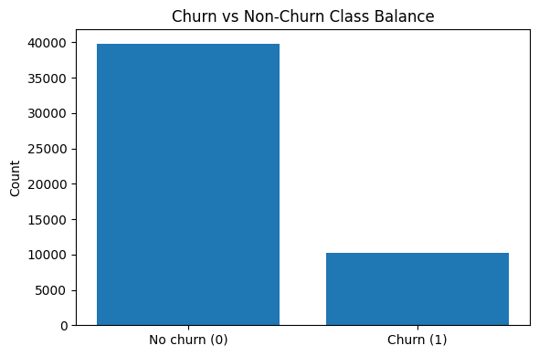
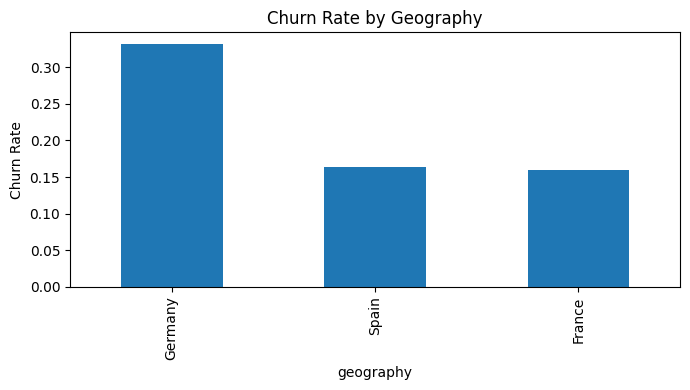
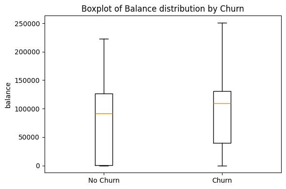
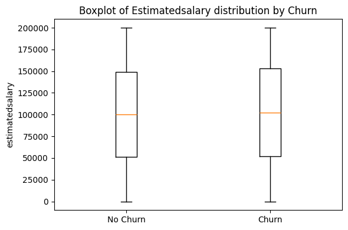
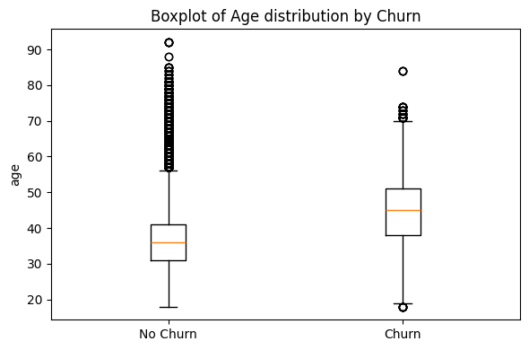
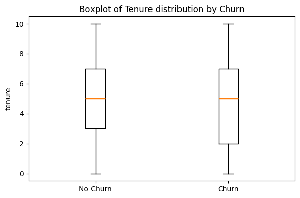
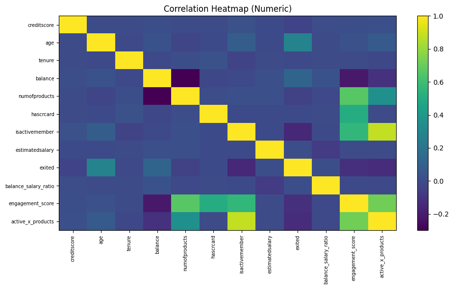
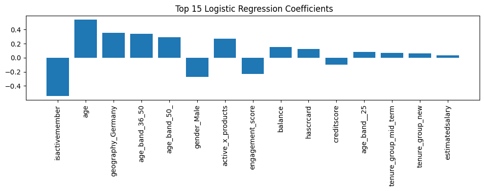
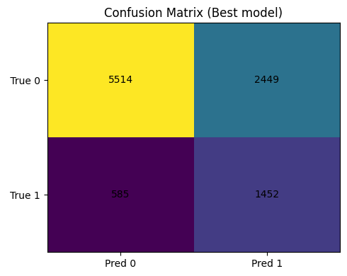
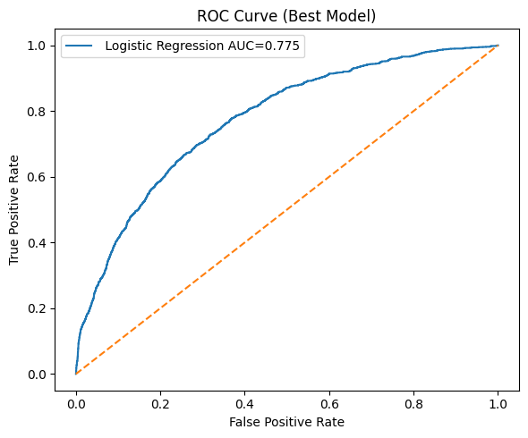

# Customer Churn Prediction in Banking using Machine Learning

## Project Overview
Customer churn is a major challenge in the banking industry. When customers leave a bank, it results in revenue loss and increased marketing costs to acquire new customers.

This project develops a Machine Learning model to predict whether a customer is likely to churn or stay with the bank. The system analyzes historical customer data and identifies patterns that indicate churn behavior.

The goal is to help banks take preventive actions to retain valuable customers.

---

## Dataset
The dataset used in this project is **bank_churn_data.csv**, containing information about bank customers:

- Credit Score
- Geography
- Gender
- Age
- Tenure
- Account Balance
- Number of Products
- Has Credit Card
- Is Active Member
- Estimated Salary

### Target Variable
Exited / Churn

- 0 → Customer stays with the bank  
- 1 → Customer leaves the bank

Dataset Size: ~50,000 rows, ~14 features

---

## Project Workflow

### 1️⃣ Data Loading
The dataset is loaded using Pandas and basic inspection is performed.

### 2️⃣ Data Preprocessing
Steps include:
- Cleaning column names  
- Handling missing values  
- Converting data types  
- Separating categorical and numerical features

### 3️⃣ Exploratory Data Analysis (EDA)

#### Churn Distribution

#### Churn by Geography

### Boxplot Analysis

#### Distribution of Features by Churn

  
  

  
  

**Insights:**
- Customers with **higher balances** show higher probability of churn.  
- **Middle-aged customers** churn more frequently.  
- **Estimated salary** does not show strong separation.  
- Customers with **lower tenure** are more likely to leave.

#### Correlation Heatmap

---

### 4️⃣ Feature Engineering
Unnecessary columns such as customer IDs are removed. The dataset is divided into:

- **X** → Input features  
- **y** → Target variable

### 5️⃣ Data Scaling
StandardScaler is applied to normalize numerical features.

### 6️⃣ Handling Class Imbalance
SMOTE (Synthetic Minority Oversampling Technique) is used to balance the dataset.

---

## Machine Learning Models Used

The following models are trained and evaluated:

1. Logistic Regression  
2. K-Nearest Neighbors (KNN)  
3. Random Forest  
4. Support Vector Machine (SVM)  
5. XGBoost

---

## Logistic Regression Results

### 1️⃣ Coefficients

### 2️⃣ Confusion Matrix & ROC Curve

  
  

---

## Model Evaluation Metrics

The models are evaluated using:

- Accuracy  
- Precision  
- Recall  
- F1 Score  
- ROC-AUC Score

| Model                | Accuracy | Precision  | Recall    | F1 Score  | ROC_AUC  |
|---------------------|---------|-----------|----------|----------|----------|
| Logistic Regression | 0.6966  | 0.372212  | 0.712813 | 0.489054 | 0.775080 |
| KNN                 | 0.9248  | 0.744762  | 0.959745 | 0.838696 | 0.989165 |
| Random Forest       | 0.9921  | 0.983696  | 0.977418 | 0.980547 | 0.998607 |
| SVM                 | 0.8549  | 0.603607  | 0.837997 | 0.701747 | 0.915443 |
| XGBoost             | 0.8731  | 0.672662  | 0.734413 | 0.702183 | 0.913340 |

**Best Model:** Logistic Regression | Input: scaled

These metrics help measure how well the model identifies churn customers.

---

## Technologies Used

- **Programming Language:** Python  
- **Libraries:** NumPy, Pandas, Matplotlib, Scikit-learn, Imbalanced-learn (SMOTE)  
- **Development Environment:** Jupyter Notebook

---

## Applications

This project can help banks to:

- Identify customers likely to leave  
- Improve customer retention strategies  
- Reduce churn rates  
- Perform targeted marketing campaigns  
- Improve overall business decision making

---

## Future Improvements

- Hyperparameter tuning  
- Feature importance analysis  
- Deploying the model using Flask or Streamlit  
- Building a real-time churn prediction dashboard  

---

## Author

**Vaishnavi Vangapally**  
Aspiring Data Scientist interested in Machine Learning, Data Analysis, and AI-based solutions.
